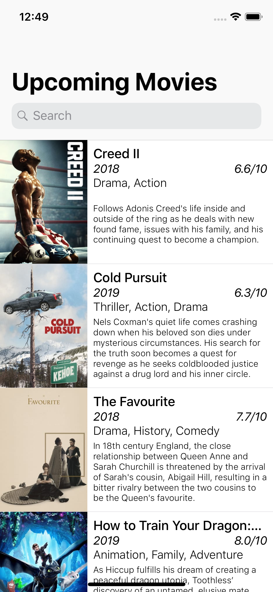
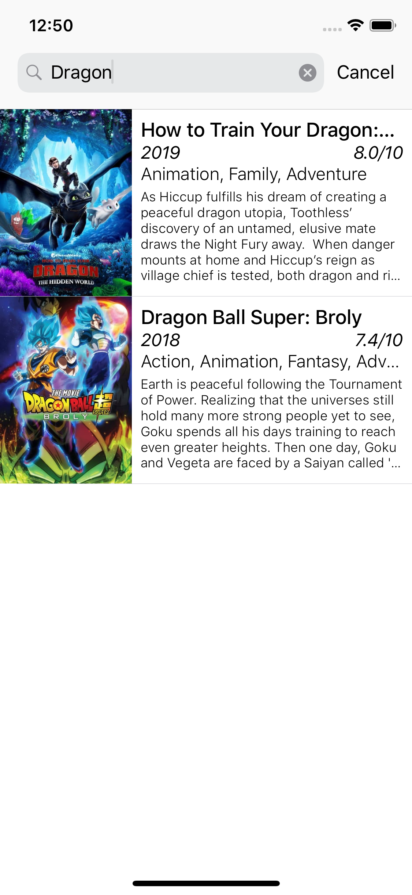

# Upcoming Movies app #

A simple app that lists all upcoming movies from the [TheMovieDB](https://www.themoviedb.org/?language=en) [API](https://developers.themoviedb.org/3/getting-started/introduction)

## Features
- List of all upcoming movies, 
- Local search
- Infinite scroll with pagination
- Error and empty state handling
- Support for all iPhones/iPads
- Detail movie screen for full information

## Installation
Open the terminal on the project root and run the commands below

- If Cocoapods is not installed (Please not ruby is required for the gem installation)
```bash
$ sudo gem install cocoapods
```
- Then, install the pods 
```bash
$ pod install
```

## Libraries

- [Kingfisher](https://github.com/onevcat/Kingfisher) - A pure Swift library for downloading and caching images. This library does all the hard work when working with images on tableviews/collectionviews, as the reuse is nearly perfect. Doing this by hand would take a tremendous amount of work and still wouldn't work out the way I wanted to.

## ScreenShots: [Detailed look](assets/screenshots)




